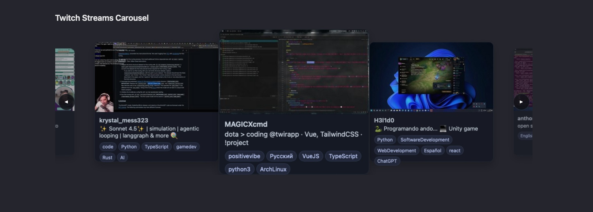
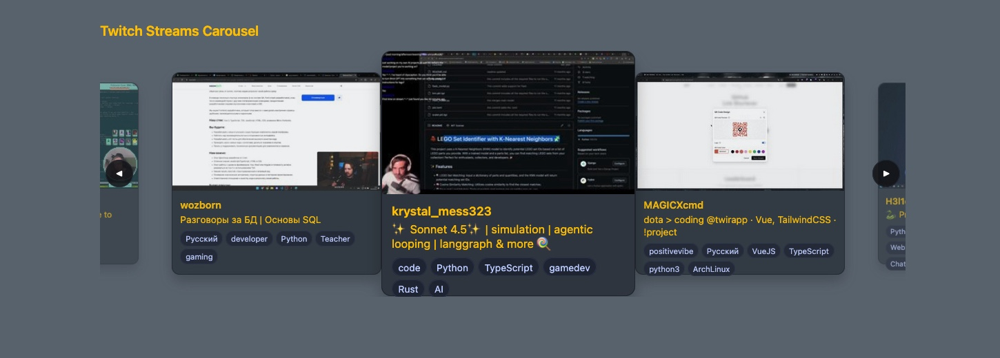

# Twitch Streams Carousel

A simple way to show live Twitch streams in a pretty, swipey (mobile-friendly) carousel on your website.

Sample Screenshot - Default Colors


Sample Screenshot - Custom Colors



You’ve got two ways to use it:

## Option 1 — Copy/paste embed (easiest)

> If you just want to try the carousel without running your own backend, a hosted build is available:

1. Paste this into your page (WordPress, Squarespace, Wix, plain HTML—anything that lets you add HTML):

```html
<iframe
	src="https://contact-me-for-url.com/twitch-carousel/?game_id=494131&keywords=chill,casual&tags=English"
	title="Twitch Carousel"
	width="1200"
	height="520"
	style="border:0; max-width:100%; width:100%;"
	sandbox="allow-scripts allow-same-origin">
</iframe>
```

* Replace `https://contact-me-for-url.com/twitch-carousel/` with a live URL wherever this project is hosted (ask me for my live link, or host it yourself using Option 2 below).
* Change what shows up by editing the link:

  * `game_id=` → the Twitch **category** number. (Don’t have one? Use the example for now—you’ll still see it work.)
  * `keywords=` → words to match in the stream title. Separate with commas.
  * `tags=` → stream tags to match. Separate with commas.

### Change colors (simple)

The embed URL supports color options! Add these to the end of the iframe URL (they’re just colors):

```
&background_color=%230f1115
&text_color=%23e6e6e6
&card_background_color=%23151924
&card_text_color=%23cbd5e1
&tag_background_color=%2322283a
&tag_text_color=%23c3d1ff
```

Example iframe embed code with custom colors:

```html
<iframe
	src="https://contact-me-for-url.com/twitch-carousel/?game_id=494131&background_color=%23646E79&text_color=%23FFC500&card_text_color=%23FFC500&card_background_color=%23353E48"
	title="Twitch Carousel"
	width="1200"
	height="520"
	style="border:0; max-width:100%; width:100%;"
	sandbox="allow-scripts allow-same-origin">
</iframe>
```

> Tip: `%23` is just the `#` in a color like `#0f1115`. URLs cannot have the `#` character, so we have to encode it as `%23`. To try a color, google “color picker”, grab a hex code (like `#ffcc00`), then replace the value (use `%23ffcc00`).

### Resize it

Change the `width` / `height` in the iframe, or just keep `style="max-width:100%; width:100%;"` to let it fit the page.

### Quick fixes

* See nothing? Remove `keywords` and `tags` so it’s less picky.
* Looks tiny? Increase `height` (e.g., `height="600"`).
* Colors not changing? Your copy might not have color options turned on—use Option 2 and edit the CSS directly.

---

## Option 2 — For developers who want control (self-host)

> **Self-hosting this is not trivial.** It requires a Twitch account with a registered app, and client ID, client Secret, and an app access token.

Run the small PHP backend and the vanilla JS frontend yourself so you can set colors, sizes, and stream rules in code.

Replace the domain with your own if you are hosting it yourself. The query string options are documented below.

## Local Requirements

* PHP 8.1+ with cURL enabled.
* A web server capable of serving PHP (Apache, Nginx + PHP-FPM, or PHP's built-in dev server).
* Twitch developer account with:
  * **Client ID**
  * **Client Secret**
  * **App Access Token** (Client Credentials Grant)
* Optional: Redis (if you want API response caching).

## Setup

1. **Clone the repository** and install dependencies (there are no Composer/NPM steps).
2. **Copy the config template** and edit it:

   ```bash
   cp config-example.php config.php
   ```

3. **Register a Twitch application** at <https://dev.twitch.tv/console/apps> and note the Client ID & Secret.
4. **Generate an App Access Token** using the Client Credentials flow. Example with `curl`:

   ```bash
   curl -X POST "https://id.twitch.tv/oauth2/token" \
   -d "client_id=$TWITCH_CLIENT_ID" \
   -d "client_secret=$TWITCH_CLIENT_SECRET" \
   -d "grant_type=client_credentials"
   ```

   Copy the `access_token` value into `TWITCH_APP_ACCESS_TOKEN` in `config.php`. (Tokens expire—regenerate as needed.)

5. **Edit `config.php`** and fill in:
   * `TWITCH_CLIENT_ID`
   * `TWITCH_CLIENT_SECRET`
   * `TWITCH_APP_ACCESS_TOKEN`
   * Optional Redis settings (`REDIS_ENABLED`, host, password, etc.)
   * Optional default carousel filters (`TWITCH_CAROUSEL_DEFAULT_*`).

6. **Serve the project** using any PHP-capable web server. For a quick local test:

   ```bash
   php -S 127.0.0.1:8080
   ```

   Then open <http://127.0.0.1:8080/> in a browser.

## Backend Endpoint (`api/streams.php`)

* **Required** query parameter: `game_id` (Twitch category ID).
* **Optional** parameters:
  * `keywords` – comma/space separated list of title keywords (case-insensitive).
  * `tags` – comma/space separated list of tag names (case-insensitive).
  * `limit` – number of streams to return (default 20, max 100 per Twitch page).
* Returns JSON with `count` and an `items` array containing `user_name`, `user_login`, `title`, `thumbnail_url`, and `tags`.
* Responses can be cached in Redis for `CACHE_TTL_SECONDS` (default 300s).

If Twitch returns an error, the endpoint responds with an error payload instead of caching the failure.

## Frontend Options (`index.php` + `main.js`)

The frontend reads query string parameters and defaults from `config.php`. Useful query params include:

| Query Param | Purpose |
|-------------|---------|
| `game_id` | Required Twitch category ID. |
| `keywords` | Filter streams whose title contains any of the terms. |
| `tags` | Require at least one matching tag. |
| `background_color` | Page background (hex, rgb(a), hsl(a), or CSS color keyword). |
| `text_color` | Page text color. |
| `card_background_color` | Carousel card background color. |
| `card_text_color` | Carousel card text color. |
| `tag_background_color` | Tag pill background. |
| `tag_text_color` | Tag pill text color. |

Example self-hosted URL:

```
https://your-domain.example/twitch-carousel/?game_id=33214&keywords=any%20%20sr%20race&tags=English
```

The carousel includes keyboard navigation (left/right arrows), button controls, and a loading overlay while streams load.

## Production Notes

* Twitch App Access Tokens expire (typically every ~60 days). Automate refreshes if you deploy long-term.
* Respect Twitch Helix rate limits. Enable Redis caching to reduce duplicate calls.
* Limit who can embed your hosted instance by tightening CORS headers and/or serving behind authentication if needed.
* Never commit real credentials. Use environment variables or secret stores in production and keep `config.php` out of source control.

## License

MIT
